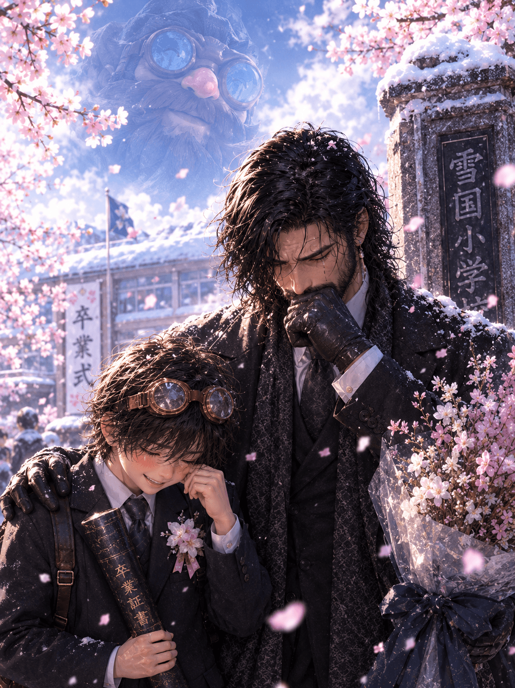
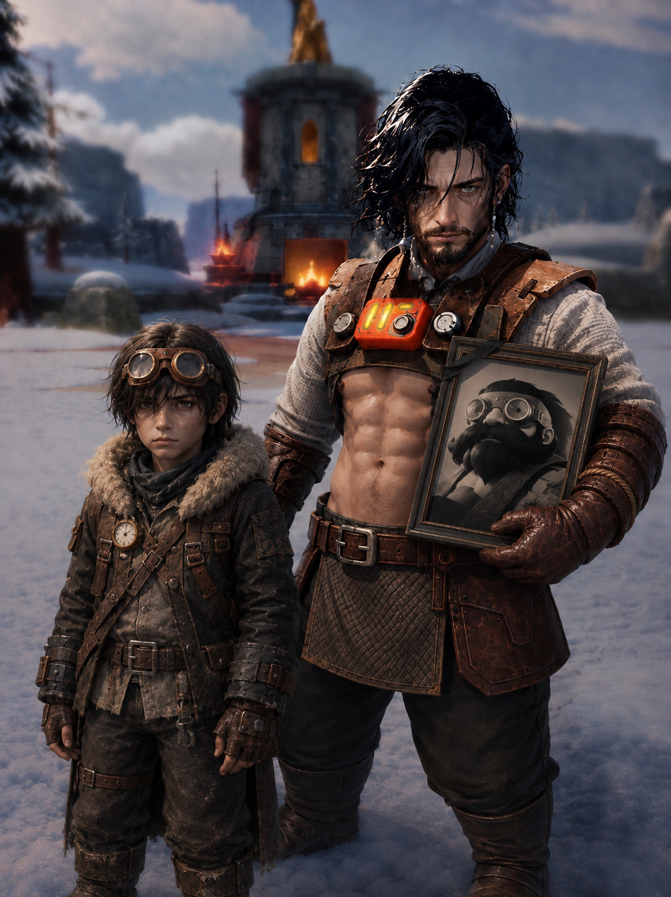
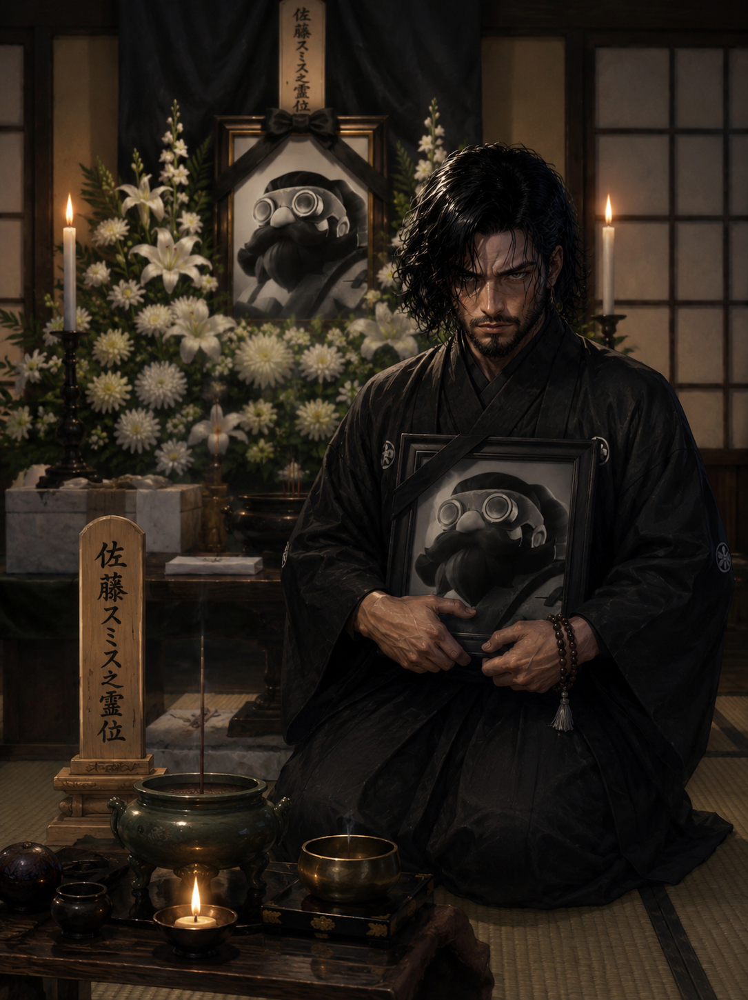
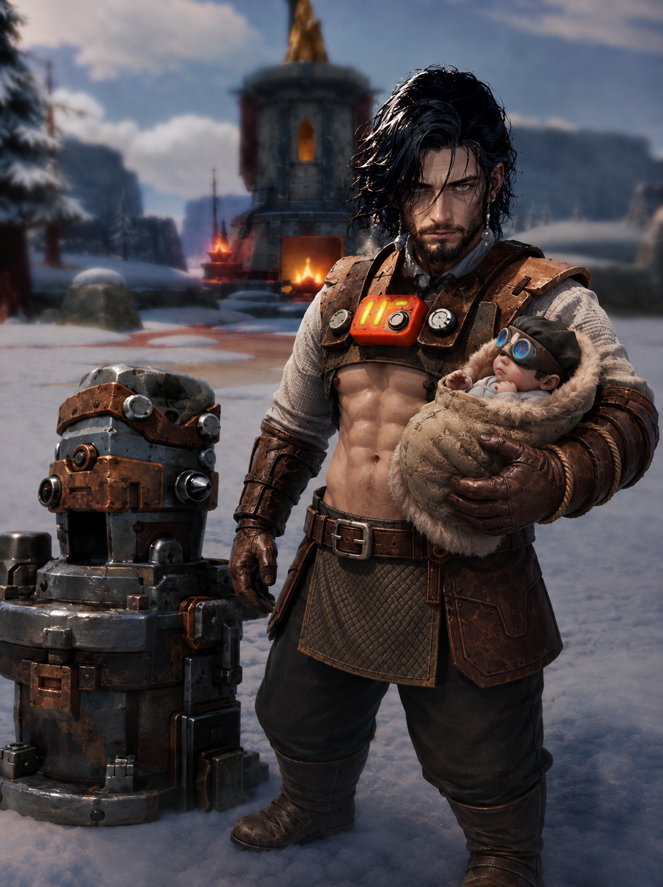
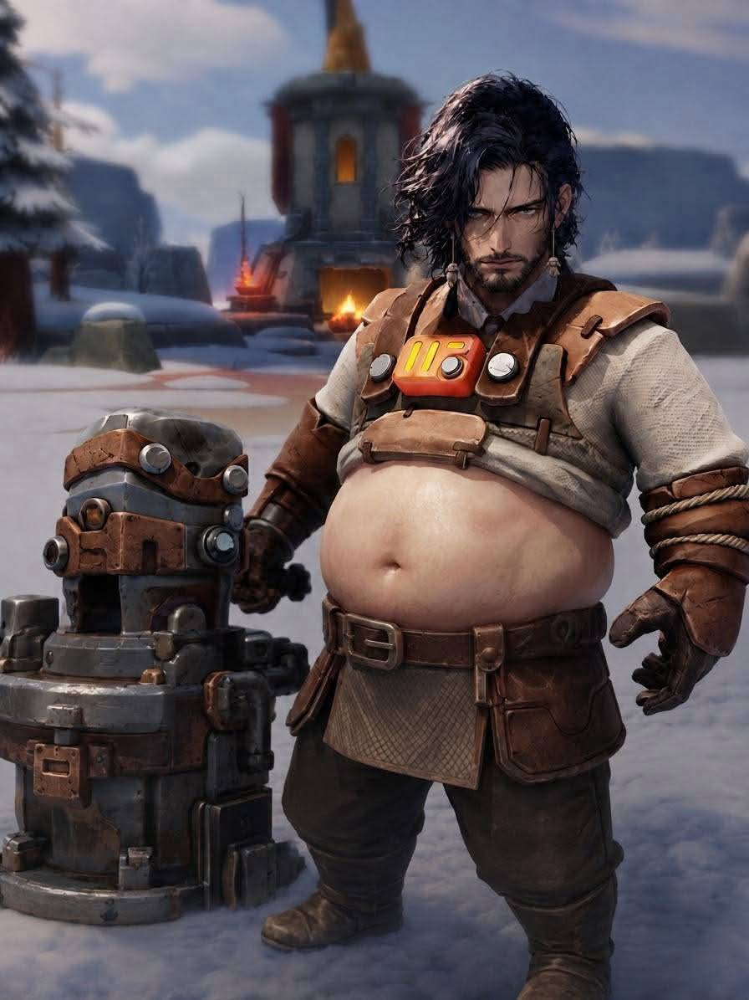

<head>
  <link rel="stylesheet" href="./css/highsan.css">
</head>

# 🔥 HIGEさん物語

## 卒業

大きくなったなスミスJr.は小学校の卒業式を迎えた。
今までシングルファーザーとして頑張ってきたピッピは感極まって涙が流れる。
  
次回「中学校へ」

## おめでとう

小学校の運動会。親子の絆は強く、親子競技では1位！
親子の絆を強固なものとなった。
  
次回「卒業」

## 大きくなったな。スミスJr.

あれから時はすぎ早5年、スクスクと強く生きる親子たち。
  
次回「おめでとう」

## 訃報

先代スミスが原因不明の死を迎え、怒りと悲しみに暮れる日々。息子と強く生きることを誓った。
  
次回「大きくなったな。スミスJr.」

## 出産？！？！？！？

ていたらくな生活が原因ではなかった！まさかの出産！元気な男の子が産まれました。名前はスミスJr.
  
次回「訃報」

## ひげっぴの運命や如何に！

日頃のサボり癖から、昔の風貌は何処へ、、かつての美貌を取り戻すことはできるのか
  
次回「出産？！？！？！？」

## ここから始まるヒゲ物語

ここから始まるヒゲ物語（略してヒゲモノ）これから起きる数々の苦難、ひげっぴの運命や如何に！

