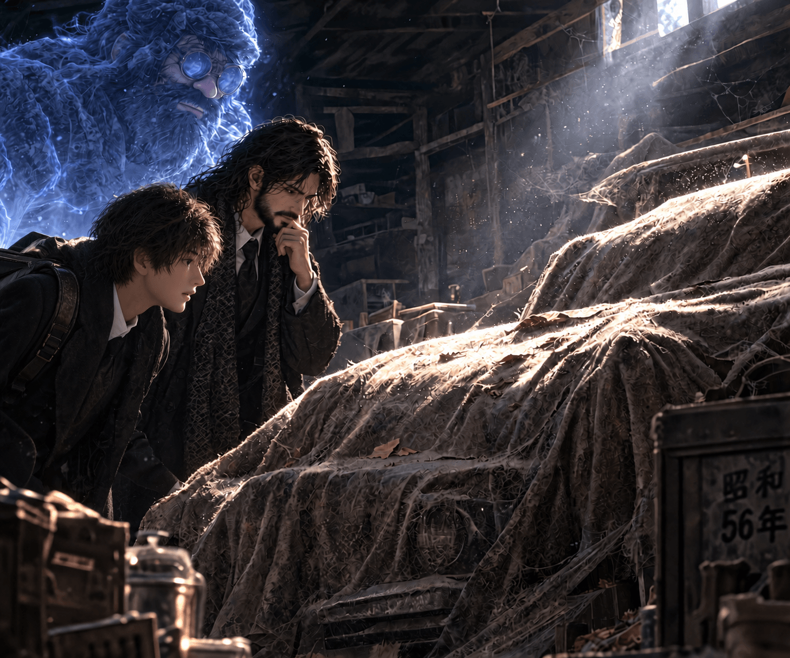
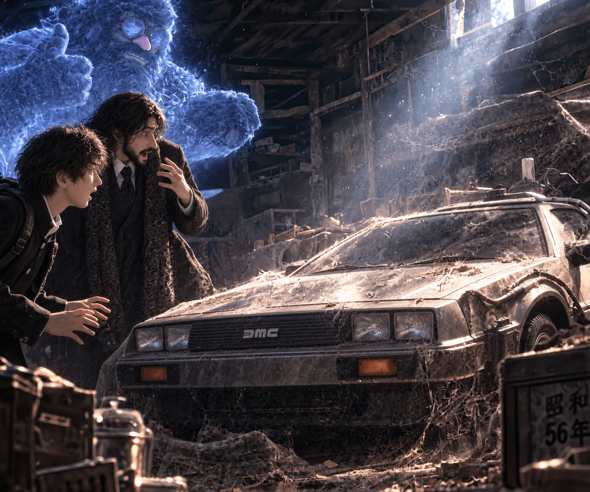
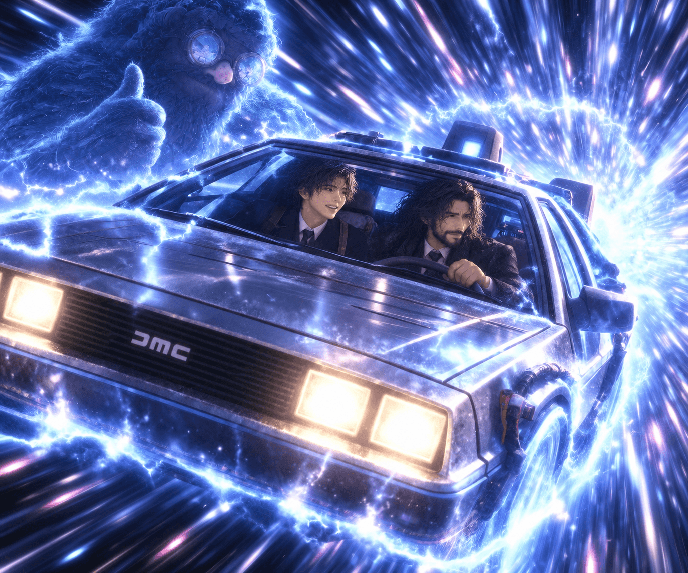
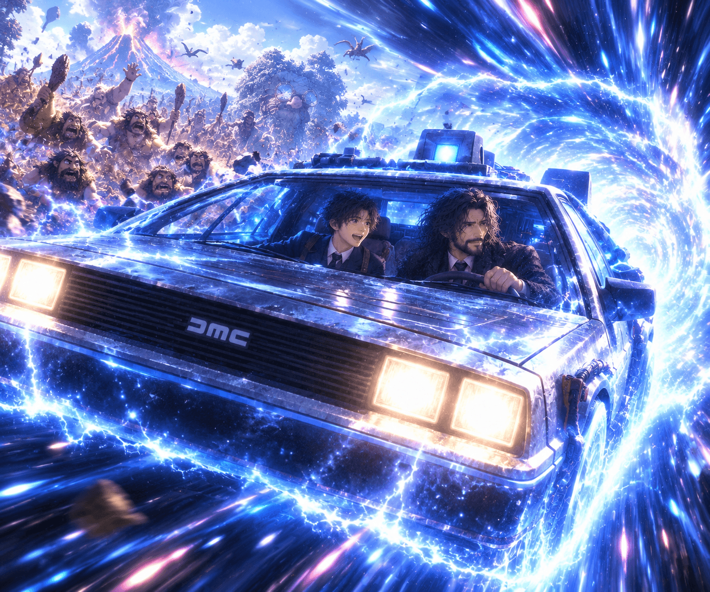
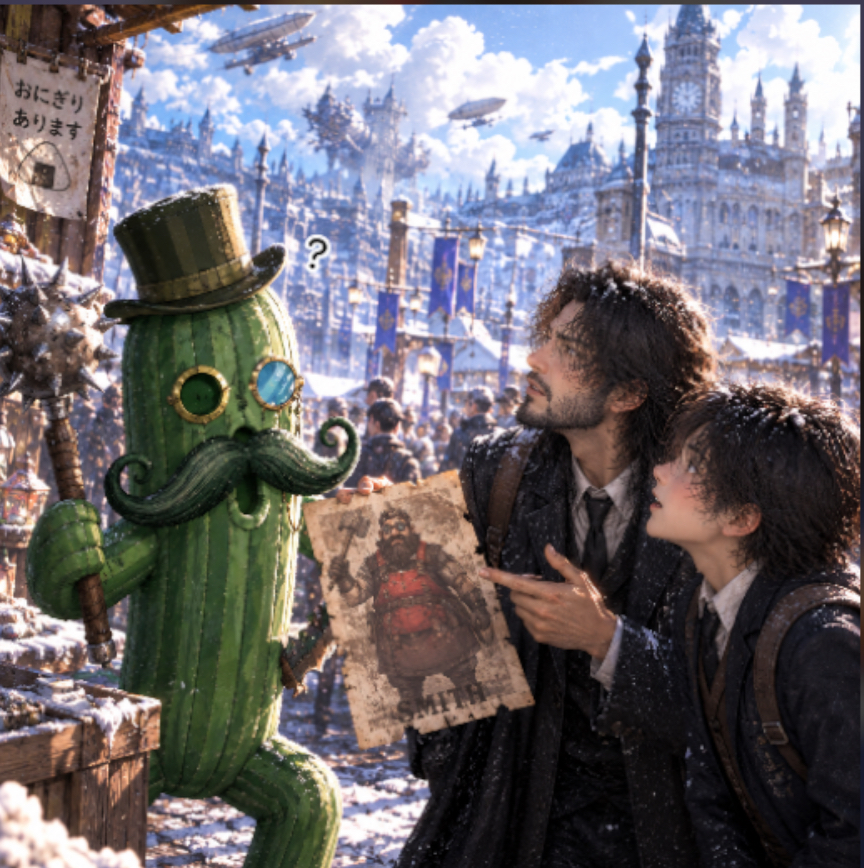
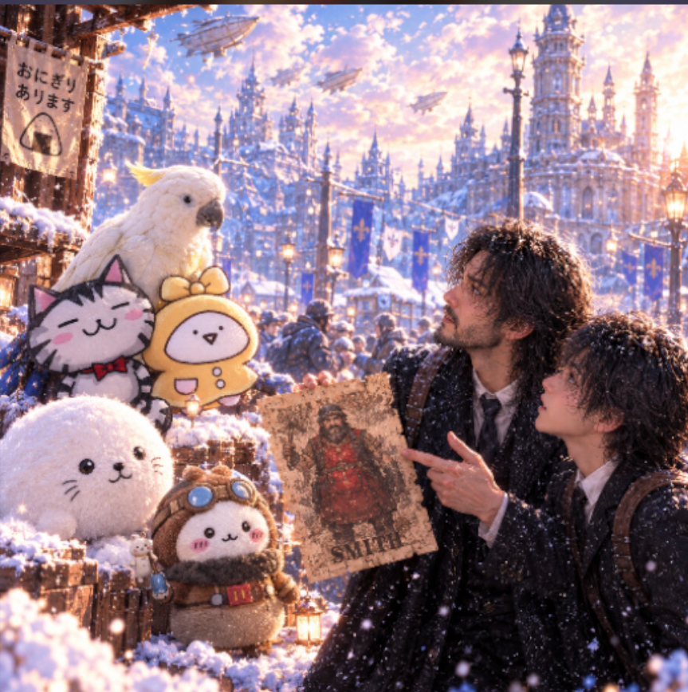
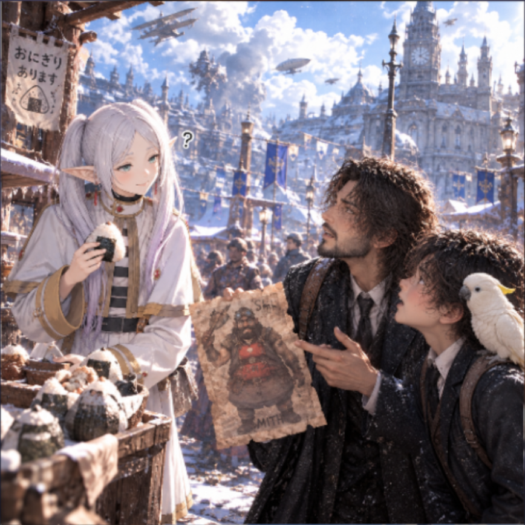

<head>
  <link rel="stylesheet" href="./css/highsan.css">
  
</head>

## [ホームページ](https://whiteoutshare.github.io/svs/post/highsan)

# 🔥 ヒゲ物語
## ヒゲモノ エピソード2
## 📖 目次
- [家の蔵](#家の蔵)
- [そこにはまさかの、、](#そこにはまさかの)
- [バックトゥザフューチャー](#バックトゥザフューチャー)
- [ここはどこ？](#ここはどこ)
- [危機一髪](#危機一髪)
- [一難去ってまた一難](#一難去ってまた一難)
- [先代スミスを探せ①](#先代スミスを探せ)
- [先代スミスを探せ②](#先代スミスを探せ-1)
- [先代スミスを探せ③](#先代スミスを探せ-2)
- [先代スミスを探せ④](#先代スミスを探せ-3)

## 家の蔵

ある日、ひげっぴとスミスJr.は、家の蔵で布のかかった何かを見つける。果たしてこれはなんなのか。
  
次回「そこにはまさかの、、」

## そこにはまさかの、、

なんとそこにはデロリアンが！思わずびっくりした2人。とりあえず、乗車してみることにする。
  
次回「バックトゥザフューチャー」

## バックトゥザフューチャー

デロリアンに乗車したふたりを待ち受けていたのは、まさかのタイムスリップ。
どこにいくのか、この2人はしらない。
  
次回「ここはどこ？」

## ここはどこ？

たどり着いた先はまさかの原始時代。どうなってしまうのか！
  
次回「危機一髪」

## 危機一髪

間一髪のところで再びデロリアンに乗り込むことに成功。
原始時代をあとに、現代へ戻ることにした。
  
次回「一難去ってまた一難」

## 一難去ってまた一難

現代に帰る予定が、途中でデロリアンから異音、、、！不時着したのは何と100前の世界。そして大破したデロリアン。どうする！！ひげ親子！
  
次回「先代スミスをさがせ①」

## 先代スミスを探せ①

デロリアンの開発者である先代スミスを探す親子、似顔絵をもとに聞き込み開始。ディカプリオに尋ねるものの居場所は掴めず、、果たして見つけることができるのか、、
  
次回「先代スミスを探せ②」

## 先代スミスを探せ②

そこにいた話せそうなサボテン🌵にも確認したが、返ってくる返事は「ジョーーーイ」のみ。先代スミスを見つけるにはまだまだ時間がかかりそうだ。
  
次回「先代スミスを探せ③」

## 先代スミスを探せ③

愉快な仲間たちを見つけた親子。何やら知ってそうだ。先代スミスに似た人が、🍙を買って頬張っていたらしい。よし、おにぎり屋さんに聞き込みだ。 
  
次回「先代スミスを探せ④」

## 先代スミスを探せ④

おにぎり屋に到着。🍙を買いつつ聞き込みをしたところ、どうやら先代スミスらしき人物が常連の模様。早速、会いに行くことに。 
  
次回「いざ出発」

## [ホームページ](https://whiteoutshare.github.io/svs/post/highsan)
## [感想,評価](https://whiteoutshare.github.io/svs/post/highsan#感想評価)
<button id="backToTop" title="ページ上部へ">↑</button>
