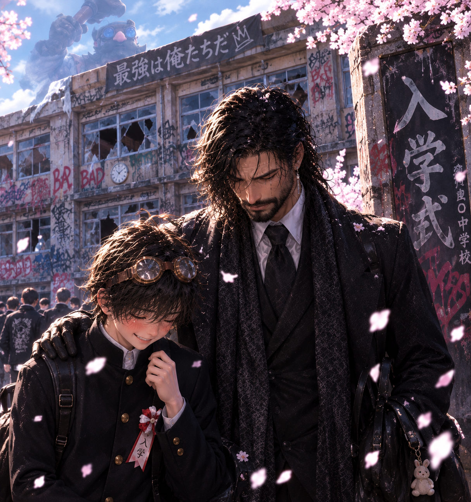
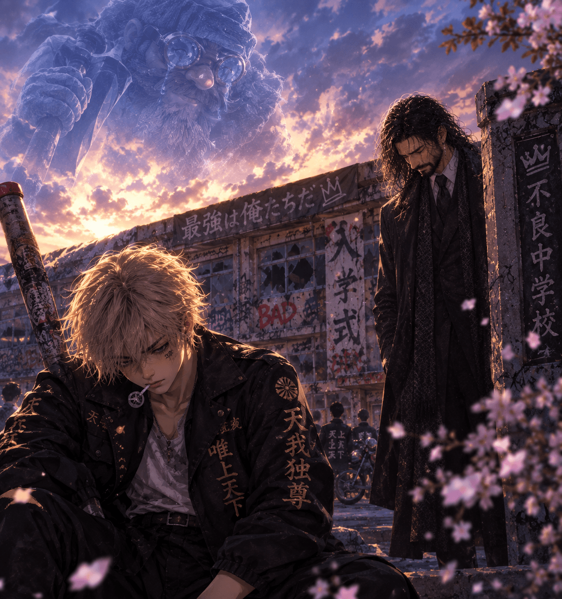
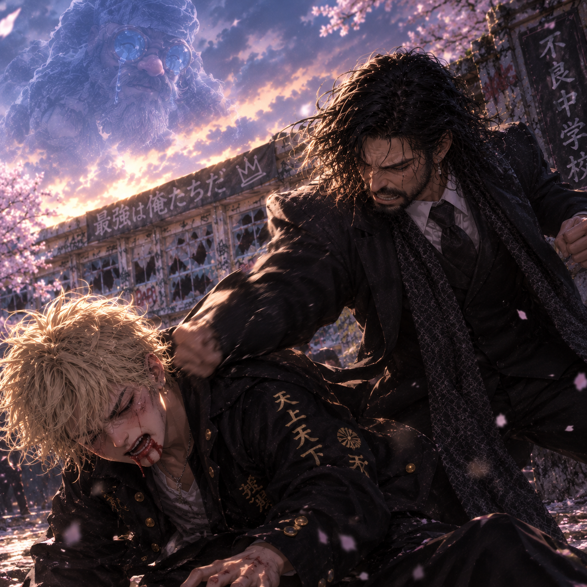
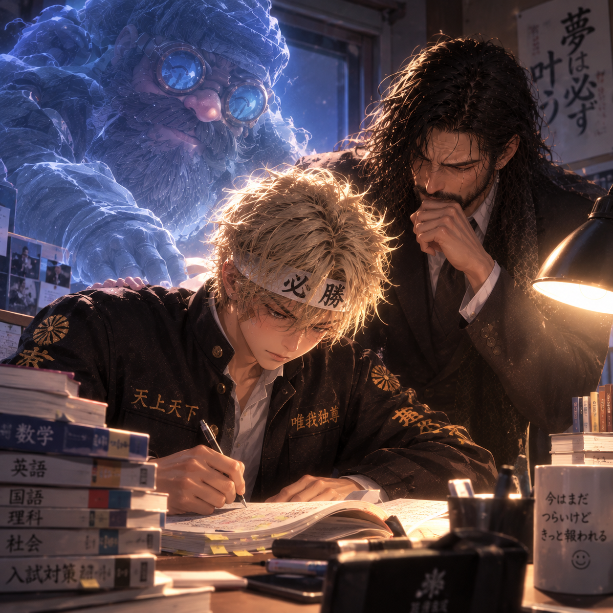
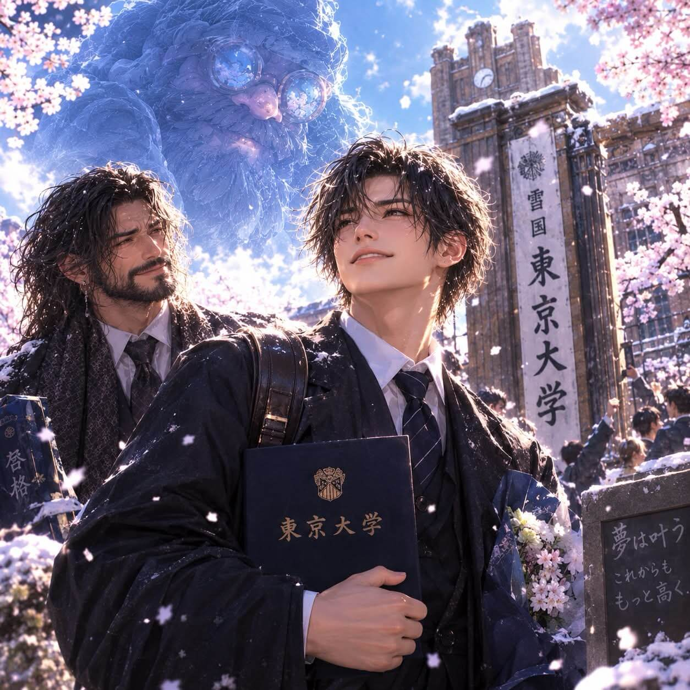
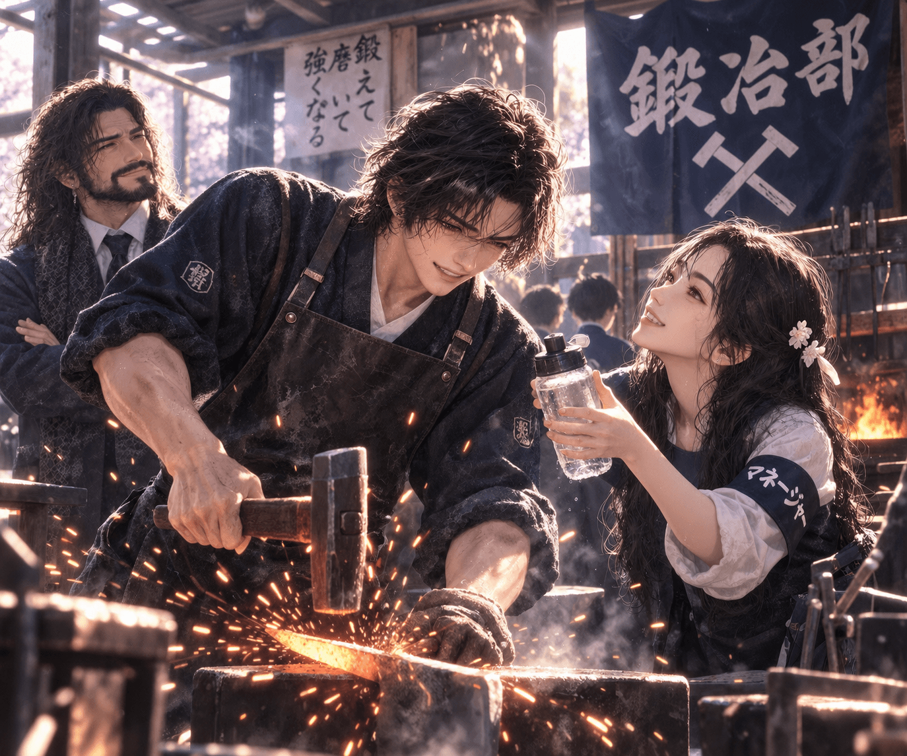
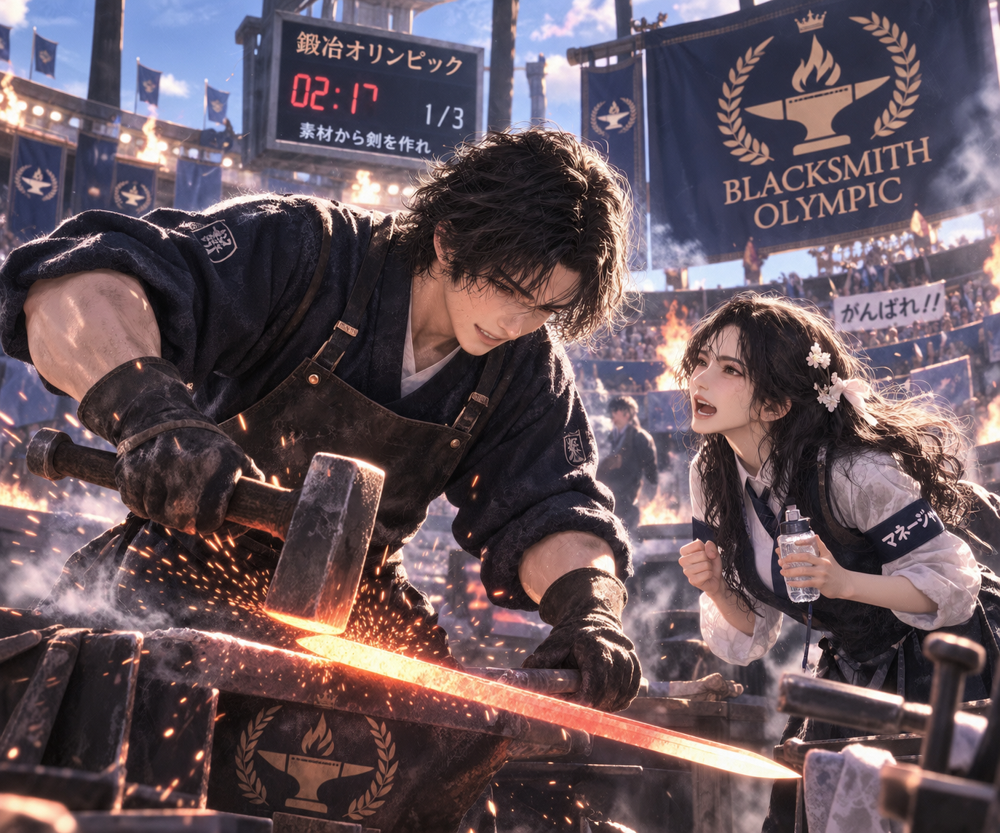
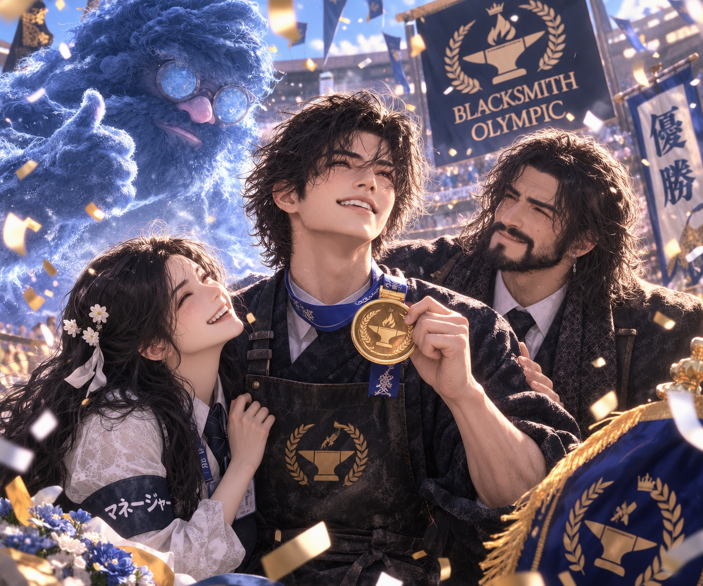
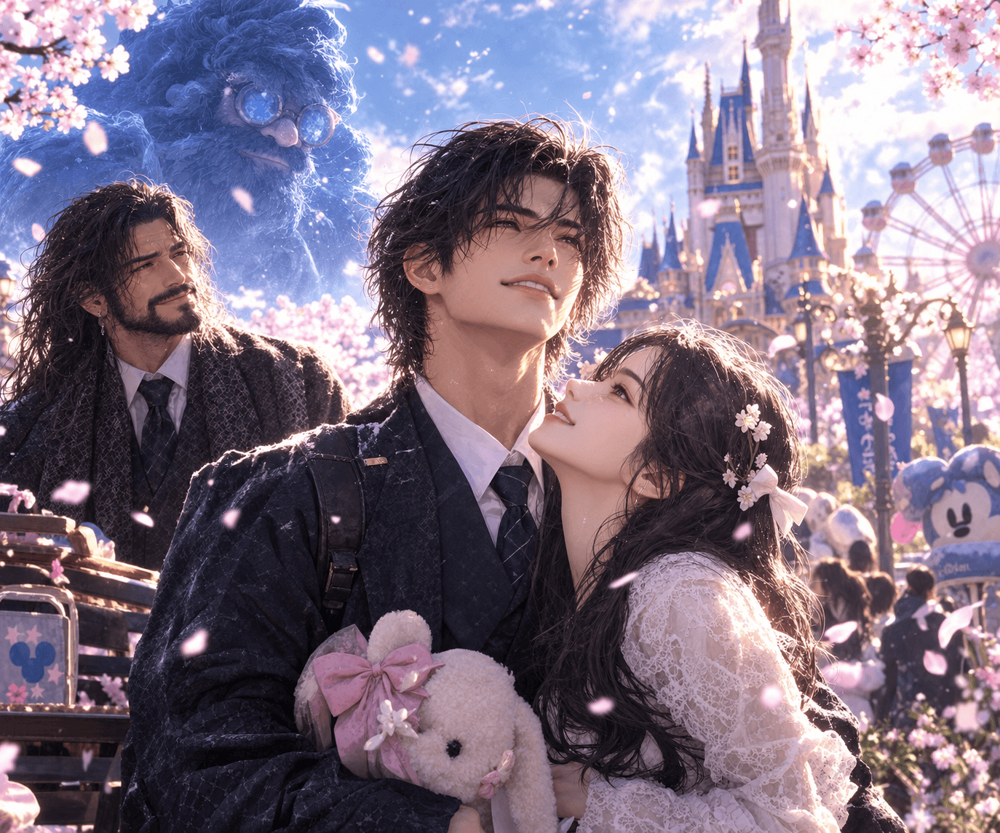

<head>
  <link rel="stylesheet" href="./css/highsan.css">
  
</head>

エピソード2スタート
ある日、ひげっぴとスミスJr.は、家の蔵で布のかかった何かを見つける。果たしてこれはなんなのか。

次回「そこにはまさかの、、」

なんとそこにはデロリアンが！思わずびっくりした2人。とりあえず、乗車してみることにする。

次回「バックトゥザフューチャー」

デロリアンに乗車したふたりを待ち受けていたのは、まさかのタイムスリップ。
どこにいくのか、この2人はしらない。

次回「ここはどこ？」

たどり着いた先はまさかの原始時代。どうなってしまうのか！
次回「危機一髪」

間一髪のところで再びデロリアンに乗り込むことに成功。
原始時代をあとに、現代へ戻ることにした。

次回「一難去ってまた一難」

現代に帰る予定が、途中でデロリアンから異音、、、！不時着したのは何と100前の世界。そして大破したデロリアン。どうする！！ひげ親子！

次回「先代スミスをさがせ①」

デロリアンの開発者である先代スミスを探す親子、似顔絵をもとに聞き込み開始。ディカプリオに尋ねるものの居場所は掴めず、、果たして見つけることができるのか、、

次回「先代スミスを探せ②」

## [ホームページ](https://whiteoutshare.github.io/svs/post/highsan)

# 🔥 ヒゲ物語
## ヒゲモノ エピソード2
## 📖 目次

## 家の蔵

ある日、ひげっぴとスミスJr.は、家の蔵で布のかかった何かを見つける。果たしてこれはなんなのか。

次回「そこにはまさかの、、」

## ひげっぴの運命や如何に！

日頃のサボり癖から、昔の風貌は何処へ、、かつての美貌を取り戻すことはできるのか
  
次回「出産？！？！？！？」

## 出産？！？！？！？

ていたらくな生活が原因ではなかった！まさかの出産！元気な男の子が産まれました。名前はスミスJr.
  
次回「訃報」

## 訃報

先代スミスが原因不明の死を迎え、怒りと悲しみに暮れる日々。息子と強く生きることを誓った。
  
次回「大きくなったな。スミスJr.」

## 大きくなったな。スミスJr.

あれから時はすぎ早5年、スクスクと強く生きる親子たち。
  
次回「おめでとう」

## おめでとう

小学校の運動会。親子の絆は強く、親子競技では1位！
親子の絆を強固なものとなった。
  
次回「卒業」

## 卒業

大きくなったなスミスJr.は小学校の卒業式を迎えた。
今までシングルファーザーとして頑張ってきたピッピは感極まって涙が流れる。
  
次回「中学校へ」

## 中学校へ

中学校の入学式。新生活の始まりだが、不穏な空気が迷う、、、
  
次回「家族の絆、崩壊」

## 家族の絆、崩壊

周りにつられ不良への道を進んでしまったスミスJr.
親子の絆が崩壊、このままで大丈夫なのか、、？！？！
  
次回「鉄拳制裁」

## 鉄拳制裁

改心させるべく、初めて子供に手を挙げたひげっぴ。愛情を込めた鉄拳制裁。スミスJr.に気持ちが伝わるのか、、
  
次回「努力」

## 努力

愛の鉄拳制裁により、心を入れ替えたスミスJr.。父親のために親孝行をすべく、猛勉強を始めることに。
  
次回「努力のその先に、、」

## 努力のその先に、、

ホワサバ国最難関の東京大学へ合格を決める。最大限の親孝行を果たしたスミスJr.。これから始まる新生活に胸を膨らませる。
  
次回「先代スミスを夢見て」

## 先代スミスを夢見て

先代スミスを夢見て鍛治職人への道を歩む。鍛治部へ入部し、猛勉強。
  
次回「ブラックスミスオリンピック開催」

## ブラックスミスオリンピック開催

いよいよ待ちに待った、オリンピック。マネージャーからの応援に勇気をもらい、全力を出し切る。
  
次回「結果発表」

## 結果発表

なんと1位！金メダルを獲得！！
  
次回「初恋」

## 初恋

マネージャーと恋に落ちたスミスJr.。生まれて初めて、女性からの温もりを感じたのであった。
  
エピソード1 完結

<button id="backToTop" title="ページ上部へ">↑</button>
